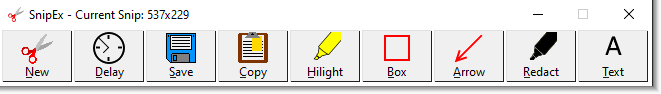
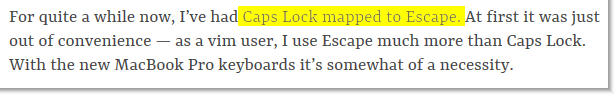
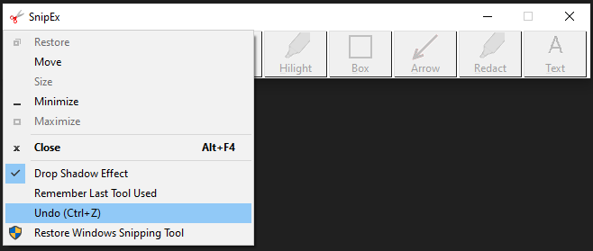
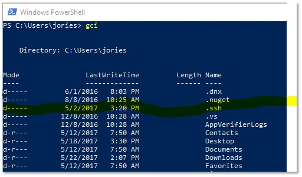
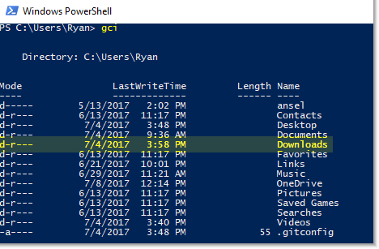

SnipEx aims to be a slightly better version of Windows' built-in Snipping Tool.

The project began when I grew tired of trying to hilight text in a screenshot, and the freehand-style hilighter would wander all over the image, making the screenshot look as if a small child had taken a hilighter to it. 
I wanted a hilighter that would travel in a perfectly straight line, for professional-looking hilighted text.

So I reinvented the wheel and the project grew from there. 

Contact ryanries09@gmail.com for any questions or bug reports or feature requests, or hit me up on Twitter @JosephRyanRies.

Shortcut keys:
-------------
 - Escape cancels an active screen capture, or exits the app.
 - N = New Snip
 - D = Delay Snip
 - S = Save Snip
 - C = Copy Snip
 - H = Hilight Snip (Toggle High-Contrast Hilighter)
 - B = Draw rectangle
 - A = Draw arrow
 - R = Redact (black marker)
 - T = Text
 - Ctrl+Z = Undo the last change

Right click on the tool buttons to cycle through different colors.

Right click on the Text button to change the font, size and color.
 
Pictures:
------------- 

The toolbar:

 

The highlighter:

The highlighter works via correlation function. The "brighter" a pixel is, where "brightness" is defined as the sum of R, G and B, the more darkly it will be highlighted. So black pixels won't be touched, while white pixels will be highlighted strongly.

Replace Windows Snipping Tool with SnipEx:

With other snipping tools, this looks bad:

This looks better:

History:
-------
Update 8/24/2020:
- Version 1.3.27
  - Added a "Automatically copy snip to clipboard" option to the drop-down menu.
  
Update 3/19/2020:
- Version 1.2.25
  - Added a new Text button!
  - Added a "Remember previously used tool" option to the drop-down menu.

Update 2/26/2020:
- Version 1.1.12
  - Added new colors for the rectangle, hilighter, and arrow tools! Just right-click the buttons to cycle through different colors!
  - Added an "Undo (Ctrl+Z)" to the drop-down menu. Ctrl+Z always worked, but the menu item might help people who don't know the keyboard shortcut.

Update 7/12/2017:
- Version 1.0.11
  - Added support for custom scaling levels up to 200%, which is the default scaling level of a Surface Pro 4. (High-DPI)
  

Update 7/11/2017:
- Version 1.0.10
  - Removed the "toggleable" high-contrast hilighter and just made that the only hilighter. Improved the hilighter quality to probably about as good as it can be, by using an correlation function. The darker a pixel is, the less hilighted it gets.
  - Added support for custom Windows GUI scaling up to 175%. If you use scaling > 175%, let me know and I will add support for you. You must be using a football stadium display as a monitor or something.

Update 7/4/2017:
- Version 1.0.9
  - Added a "high-contrast" hilighter. Click the hilighter tool multiple times to toggle it. It helps make hilighted text look better under most conditions.

  
Update 6/21/2017:
- Version 1.0.8
  - Added an elegant drop shadow effect which can be toggled on and off. You can find it in the drop-down menu in the top-left corner of the app. Your preference is saved in the registry.

  
Update 6/17/2017:
- Version 1.0.7
  - Added support for saving images in PNG format.

  
Update 6/13/2017:
- Version 1.0.6
  - Fixed an issue where if the user set a custom scaling factor, the title bar would be larger than expected and cut into the window's client area, clipping off the bottom of the buttons.

  
Update 6/12/2017:
- Version 1.0.5
  - Fixed button font size and face to avoid issues when user's DEFAULT_GUI_FONT is larger than expected.
  
  
Update 6/11/2017:
- Version 1.0.4
  - Added "Redact" drawing tool.
  - Fixed a bug where I assumed that the top-left coordinate of the user's viewing area was always (0,0), but that is not true if the user has multiple monitors and they are arranged in an unusual order.
  - Signed the binary.

Update 5/30/2017:
- Version 1.0.3
  - Added the "Arrow" drawing tool.
  - Added a UAC icon to the "Replace Snipping Tool" menu item.

  
Update 5/24/2017:
- Version 1.0.1
  - Added a "Replace Snipping Tool with SnipEx" and "Restore Snipping Tool" option from the application's system menu in the top-left corner. This works like Sysinternals' Process Explorer's "Replace Task Manager".
  - Added a missing call to UpdateWindow that should make drawing with the hilighter look a little smoother. Increased the amount of pixels that can be drawn over before the hilighted area begins to become more opaque.
 
 
Contact ryanries09@gmail.com for any questions or bug reports or feature requests, or hit me up on Twitter @JosephRyanRies.